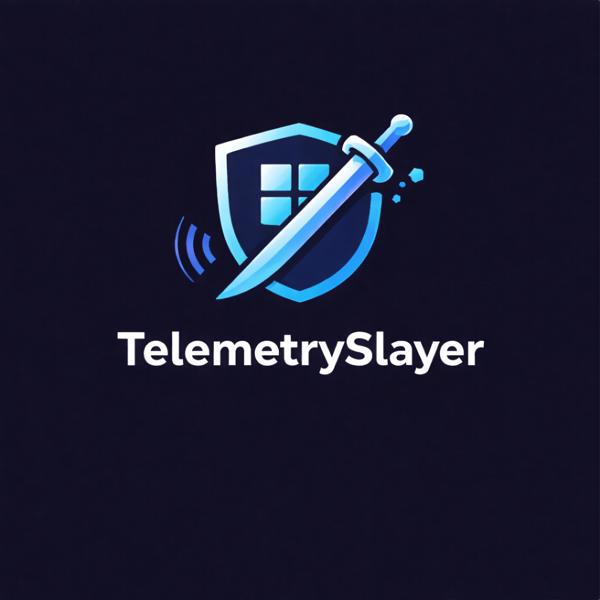
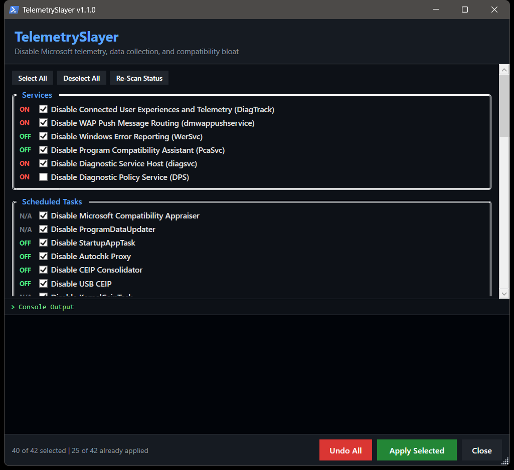

<p align="center"></p>

# TelemetrySlayer


> A comprehensive, GUI-driven tool that disables Microsoft telemetry, data collection, compatibility bloat, and phone-home services across Windows 10/11 — with real-time console feedback and persistent hardening that survives Windows Update re-enablement.



---

## Quick Start (Verified Download)

### Option 1: Download and Verify

```powershell
# Download the script
Invoke-WebRequest -Uri https://github.com/SysAdminDoc/TelemetrySlayer/releases/latest/download/TelemetrySlayer.ps1 -OutFile TelemetrySlayer.ps1

# Verify SHA256 checksum against the value published in the GitHub Release
(Get-FileHash -Algorithm SHA256 TelemetrySlayer.ps1).Hash

# Run
powershell -ExecutionPolicy Bypass -File TelemetrySlayer.ps1
```

### Option 2: Manual Download

1. Download `TelemetrySlayer.ps1` from the [latest release](https://github.com/SysAdminDoc/TelemetrySlayer/releases/latest)
2. Compare `(Get-FileHash TelemetrySlayer.ps1).Hash` against the SHA256 in the release notes
3. Right-click → **Run with PowerShell**, or from terminal: `powershell -ExecutionPolicy Bypass -File TelemetrySlayer.ps1`

### Option 3: One-Liner (Advanced / Unattended)

> **Trust warning:** `Invoke-Expression` executes arbitrary remote code. Only use this if you trust the source and accept the risk of running unverified scripts. For production or managed environments, use Option 1 or 2.

```powershell
irm https://raw.githubusercontent.com/SysAdminDoc/TelemetrySlayer/main/TelemetrySlayer.ps1 | iex
```

The script auto-elevates to Administrator. No dependencies, no modules, no installers — single file, fully turnkey.

---

## Features

### Services

| Feature | Service Name | Description | Default |
|---------|-------------|-------------|---------|
| Connected User Experiences and Telemetry | `DiagTrack` | Primary telemetry pipeline — collects and transmits diagnostic data to Microsoft | On |
| WAP Push Message Routing | `dmwappushservice` | Routes push messages used alongside DiagTrack for telemetry delivery | On |
| Windows Error Reporting | `WerSvc` | Sends crash dumps and error reports to Microsoft | On |
| Program Compatibility Assistant | `PcaSvc` | Monitors programs for compatibility issues; triggers CompatTelRunner.exe CPU spikes | On |
| Diagnostic Service Host | `diagsvc` | Hosts diagnostic scenarios triggered by the Diagnostic Policy Service | On |
| Diagnostic Policy Service | `DPS` | Core diagnostic detection and troubleshooting engine | Off |

### Scheduled Tasks

| Feature | Task Path | Description | Default |
|---------|-----------|-------------|---------|
| Microsoft Compatibility Appraiser | Application Experience | Primary cause of CompatTelRunner.exe high CPU/disk — scans system files for upgrade compatibility | On |
| ProgramDataUpdater | Application Experience | Collects program telemetry when opted into CEIP | On |
| StartupAppTask | Application Experience | Scans startup entries for telemetry collection | On |
| PcaPatchDbTask | Application Experience | Updates compatibility database; triggers CompatTelRunner runs | On |
| Autochk Proxy | Autochk | Collects SQM (Software Quality Management) data | On |
| CEIP Consolidator | Customer Experience Improvement Program | Consolidates and sends CEIP usage data to Microsoft | On |
| USB CEIP | Customer Experience Improvement Program | Collects USB bus statistics for Microsoft device engineers | On |
| KernelCeipTask | Customer Experience Improvement Program | Kernel-level CEIP data collector | On |
| DiskDiagnosticDataCollector | DiskDiagnostic | Collects general disk/system info and sends to Microsoft | On |
| SmartScreenSpecific | AppID | SmartScreen-related telemetry task | Off |

### Registry and Policy

| Feature | Description | Default |
|---------|-------------|---------|
| SKU-aware AllowTelemetry | Sets `AllowTelemetry` / `MaxTelemetryAllowed` to 0 where Windows supports diagnostic data off, or 1 where the SKU only allows required diagnostic data | On |
| Disable Advertising ID | Prevents cross-app ad profiling via advertising identifier | On |
| Disable Linguistic Data Collection | Stops inking and typing data collection | On |
| Disable Tailored Experiences | Blocks Microsoft from using diagnostics for personalized tips/ads | On |
| Disable Feedback Notifications | Sets feedback frequency to Never | On |
| Disable Activity History / Timeline | Stops activity history collection and cloud sync | On |
| Disable Location Tracking | Disables Windows location platform sensor | On |
| Disable Input Personalization | Disables cloud speech recognition and typing personalization | On |
| Disable Handwriting Error Reporting | Prevents sharing handwriting recognition error data | On |
| Disable App Inventory Collector | Stops Inventory Collector from reporting installed applications | On |
| Disable Steps Recorder | Disables psr.exe screenshot/input capture tool | On |
| Disable Wi-Fi Sense / Hotspot Reporting | Prevents automatic Wi-Fi credential sharing and hotspot reporting | On |

### Firewall and Hardening

| Feature | Description | Default |
|---------|-------------|---------|
| Block CompatTelRunner.exe | Outbound firewall rule blocking the compatibility telemetry runner from phoning home | On |
| Block wsqmcons.exe | Outbound firewall rule blocking the CEIP data sender | On |
| Block DiagTrack svchost | Outbound firewall rule blocking DiagTrack service network access | On |
| IFEO Debugger on CompatTelRunner.exe | Image File Execution Options trick — instantly kills CompatTelRunner.exe whenever Windows launches it, surviving updates and re-enablement | On |
| Clear DiagTrack ETL Logs | Empties `AutoLogger-Diagtrack-Listener.etl` and disables the autologger session | On |

### Restore and Safety

| Feature | Description | Default |
|---------|-------------|---------|
| Exact Undo Snapshot | Apply records prior registry value/type/absence, service startup/status, exact scheduled-task IDs, firewall rule baselines, IFEO, and autologger state under `%ProgramData%\TelemetrySlayer\State` | On |
| Preflight Backup Bundle | Apply writes `%ProgramData%\TelemetrySlayer\Backups\backup-<timestamp>` with a manifest, restore snapshot copy, registry exports for managed keys, and restore-point attempt status before changing the machine | On |
| Timeout-Safe Service Control | Service stop/start/startup changes run through `sc.exe` with timeout, retry/backoff, exit-code logging, and visible failure output | On |
| SKU-Aware Diagnostic Data | Scan detects product name, build, edition, LTSC, and Server status; the AllowTelemetry toggle text and tooltip show the applied value and reason | On |

### Office Telemetry

| Feature | Description | Default |
|---------|-------------|---------|
| Disable Office Telemetry Agent | Disables telemetry logging and upload for Office 15.0 and 16.0 | On |
| Disable Office Feedback and Surveys | Prevents Office feedback collection, surveys, and connected experiences | On |

### Edge Telemetry

| Feature | Description | Default |
|---------|-------------|---------|
| Disable Edge Diagnostic Data and Feedback | Sets `DiagnosticData=0`, `PersonalizationReportingEnabled=0`, and `UserFeedbackAllowed=0` | On |
| Disable Edge Metrics, Sidebar, and Copilot | Disables `MetricsReportingEnabled`, `SendSiteInfoToImproveServices`, `HubsSidebarEnabled`, `CopilotPageContext`, `CopilotCDPPageContext`, and `DiscoverPageContextEnabled` | On |
| Disable Edge WebView2 Telemetry | Disables `DiagnosticData`, `MetricsReportingEnabled`, and `PersonalizationReportingEnabled` for the WebView2 runtime | On |

### Nvidia Telemetry

| Feature | Description | Default |
|---------|-------------|---------|
| Disable NvTelemetryContainer Service | Stops and disables the Nvidia Telemetry Container service | On |
| Disable Nvidia Telemetry Tasks | Disables NvTmMon, NvTmRep, and NvProfileUpdater scheduled tasks | On |
| Disable Nvidia Telemetry Registry | Sets `Optimus_EnableTelemetry=0` and `NvTelemetryContainer Start=4` | On |

### Visual Studio Telemetry

| Feature | Description | Default |
|---------|-------------|---------|
| Disable Visual Studio Telemetry | Disables VS telemetry opt-in, CEIP/SQM, and feedback dialog/email/screenshot capture | On |
| Disable VS Collector and PerfWatson | Stops VSStandardCollectorService150 and kills PerfWatson2 | On |

---

## How It Works

```
┌─────────────────────┐     ┌─────────────────────┐     ┌─────────────────────┐
│    WPF GUI Thread    │     │   ConcurrentQueue    │     │  Background Worker   │
│                     │     │                     │     │                     │
│  Checkbox toggles   │────>│  Thread-safe bridge  │<────│  Services, Tasks,   │
│  Console output     │     │  for log streaming   │     │  Registry, Firewall  │
│  Status bar         │     │                     │     │  IFEO, ETL, gpupdate │
└─────────────────────┘     └─────────────────────┘     └─────────────────────┘
        ▲                           │
        │    DispatcherTimer        │
        │    polls @ 100ms          │
        └───────────────────────────┘
```

1. **UI thread** captures all checkbox states into a hashtable
2. **Worker runspace** writes an exact restore snapshot and preflight backup bundle, then executes operations (timeout-safe service control, task disabling, registry writes, firewall rules) in a separate thread to keep the GUI responsive
3. **ConcurrentQueue** bridges the worker and UI — log messages stream in real-time as each operation completes
4. **DispatcherTimer** drains the queue every 100ms and appends to the embedded console
5. **gpupdate /force** runs at the end to apply Group Policy changes immediately

---

## Why the IFEO Trick Matters

Windows Update frequently re-enables telemetry tasks and services after feature updates. The standard approach of disabling scheduled tasks and services gets silently undone. TelemetrySlayer's IFEO (Image File Execution Options) debugger entry sets `taskkill.exe` as the debugger for `CompatTelRunner.exe` — meaning every time Windows tries to launch it, the process is immediately terminated before it can execute. This persists across updates and re-enablement attempts.

Combined with outbound firewall rules, this provides defense-in-depth: even if services are re-enabled, they can't phone home or consume resources.

---

## Prerequisites

- **OS:** Windows 10 / Windows 11 (any edition)
- **PowerShell:** 5.1+ (ships with Windows 10/11)
- **Privileges:** Administrator (script auto-elevates)
- **Dependencies:** None — uses only built-in .NET assemblies

---

## What It Does and Doesn't Do

**Does:**
- Disable telemetry services, scheduled tasks, and registry-based data collection
- Block telemetry executables at the firewall level
- Prevent CompatTelRunner.exe from launching via IFEO
- Clear existing telemetry log data
- Disable Office telemetry and feedback
- Disable Edge diagnostic data, feedback, metrics, Copilot sidebar, and WebView2 telemetry
- Disable Nvidia and Visual Studio telemetry services, tasks, and registry keys
- Write a preflight recovery bundle with registry exports, restore snapshot copy, manifest, and restore-point attempt status
- Restore prior registry values, service startup/status, scheduled-task enabled state, firewall baselines, IFEO, and autologger settings from the latest apply snapshot
- Apply the documented diagnostic data value for the detected Windows SKU and log the reason
- Apply changes via Group Policy update
- Provide granular per-item control with sane defaults

**Doesn't:**
- Remove Windows Defender or SmartScreen protection (SmartScreen task is off by default)
- Modify Windows Update behavior
- Delete system files or take ownership of OS binaries
- Require any external tools, modules, or downloads
- Phone home or collect any data itself

---

## Enterprise Deployment

### Silent Mode

Run without the GUI for automated/RMM deployment:

```powershell
# Apply Balanced preset (default)
powershell -ExecutionPolicy Bypass -File TelemetrySlayer.ps1 -Silent

# Apply Paranoid preset (enables DPS and SmartScreen task disabling)
powershell -ExecutionPolicy Bypass -File TelemetrySlayer.ps1 -Silent -Preset Paranoid

# Apply Minimal preset (core telemetry only, skips Nvidia/VS/firewall)
powershell -ExecutionPolicy Bypass -File TelemetrySlayer.ps1 -Silent -Preset Minimal

# Dry run (shows what would change without modifying the system)
powershell -ExecutionPolicy Bypass -File TelemetrySlayer.ps1 -Silent -WhatIf

# Custom config file (JSON overrides for individual toggles)
powershell -ExecutionPolicy Bypass -File TelemetrySlayer.ps1 -Silent -ConfigPath config.json

# Custom log path
powershell -ExecutionPolicy Bypass -File TelemetrySlayer.ps1 -Silent -LogPath C:\Logs\telemetry.log
```

Exit codes: `0` = success, `1` = one or more actions failed. Logs are written to `%ProgramData%\TelemetrySlayer\Logs\` by default.

### NinjaOne

1. Create new Script → PowerShell
2. Paste `TelemetrySlayer.ps1` content
3. Set execution policy: Bypass
4. Deploy to device group

### Datto RMM

1. New Component → PowerShell
2. Upload `TelemetrySlayer.ps1`
3. Set execution policy: Bypass
4. Schedule or push to endpoints

### PDQ Deploy

1. New Package → PowerShell Step
2. Script: `powershell -ExecutionPolicy Bypass -File "TelemetrySlayer.ps1"`
3. Run As: Deploy User (with admin rights)

---

## FAQ / Troubleshooting

**Q: Is it safe to disable these services and tasks?**
Disabling telemetry does not affect normal Windows operation, application compatibility, or security updates. Microsoft's own documentation confirms these are data collection mechanisms, not core OS functionality.

**Q: Will Windows Update undo my changes?**
Standard registry and service changes can be re-enabled by feature updates. The IFEO debugger trick and firewall rules provide persistent protection that survives updates. After major feature updates, re-running the script is recommended.

**Q: Why is DPS unchecked by default?**
The Diagnostic Policy Service provides some legitimate auto-troubleshooting for network and disk issues. Disabling it is optional for users who want maximum telemetry reduction.

**Q: Why is SmartScreen unchecked by default?**
SmartScreen provides real security value by checking downloaded files against known malware databases. The telemetry task associated with it is minor compared to the protection it offers.

**Q: Can I undo changes?**
Yes. Apply writes a timestamped restore snapshot under `%ProgramData%\TelemetrySlayer\State`, and **Undo All** restores the prior registry values/types/absence, service startup/status, exact scheduled-task state, firewall rule baseline, IFEO value, and autologger setting from that snapshot.

---

## License

[MIT](LICENSE) — use it, fork it, deploy it.

---

## Contributing

Issues and PRs welcome. If you find a telemetry vector that isn't covered, open an issue.
